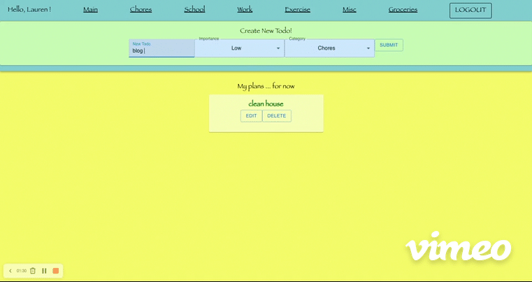
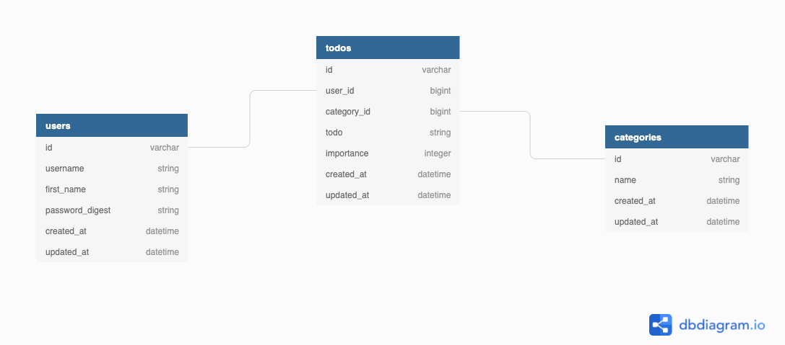

<h1>The Plan for Now</h1>

Right click on the `README.md` file and select `Open Preview` to view in preview mode.

This is an application that allows a user to create a personalized to-do list.



This is a Rails and React fully built application using Ruby v 2.7.4, Rails v 7.0.2.2, Node v 16.3.0, and postgresql v 14.2.

<h2>Setup</h2>

To download the dependencies for both the frontend and backend, from the root directory in your terminal run:

```sh
bundle install
npm install --prefix client
```

The models and the relationships for the database and tables are outlined here:



There is some starter code in the 'db/seeds.rb' file.  To seed the data, run:

```sh
rails db:seed
```

You can run your Rails API on [`localhost:3000`](http://localhost:3000) by running:

```sh
rails s
```

You can run your React app on [`localhost:4000`](http://localhost:4000) by running:

```sh
npm start --prefix client
```
